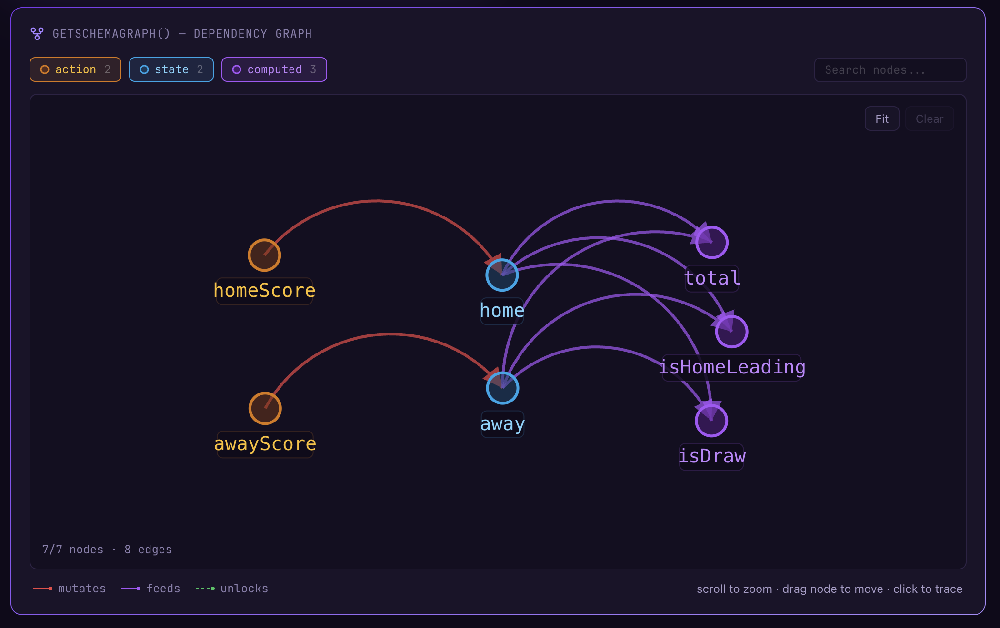

# Superintelligence in My Hands

## What remains — and what vanishes — when AI compresses expertise

---

I'm a frontend developer. Six years of React and TypeScript, currently building a robotics platform at KT, a Korean telecom company. No background in compiler theory. No PhD.

Four months ago, I was designing a DSL (domain-specific language) compiler for a state description language built for AI agents. Formal semantics, type system soundness, intermediate representation design — none of it was my field. In April 2026, I put an experiment built on this framework [on arXiv](https://arxiv.org/abs/2604.07236).

This isn't a brag. It's a confession.

I did all of this with AI. It would have been impossible without it. And that fact is both exhilarating and frightening. It feels like I've caught up to roughly 80% of what would normally take years of dedicated study and experience — in four months. That "80%" is the number that keeps me up at night.

---

### A feeling with no name

The story starts long before AI.

Over the past several years, I've built a variety of SaaS products. Robotics fleet management, map generation tools, products across different domains. With each new business logic I implemented, a strange feeling accumulated: different domains kept exhibiting the same structures.

E-commerce's "cart → checkout → shipping" and robotics' "mission assignment → execution → report." The surface couldn't be more different, but the way states transitioned, conditions branched, and exceptions were handled — these were strikingly similar. It wasn't just design patterns repeating. Deeper down, the domains themselves seemed to share a semantic skeleton.

I had no name for this feeling. So I shelved it. Then one day, on a run, it collapsed into a single sentence.

---

### One axiom

I run 10km a day. About 140km a month, going on four years now. My thinking during runs isn't linear — it jumps from concept to concept like hyperlinks. This ADHD-style cognition is surprisingly useful for detecting blind spots in existing solutions.

Years of accumulated intuition crystallized on asphalt into one sentence:

> **Every domain is a coordinate in a single semantic space.**

E-commerce, robotics, healthcare — each domain looks like its own world, but they're really just occupying different coordinates in a larger semantic space. The axes of that space are universal primitives: state, transition, and constraint.

This was the starting point of [Manifesto](https://github.com/manifesto-ai/core). Not a technical innovation, but an axiom. And once you accept this axiom, certain things follow naturally. You need a language that can formally describe domain structures. For AI to reason over that language, it must be deterministic. For humans and AI to share the same world model, it must be a semantic interface readable by both.

I had the axiom. What I didn't have was the ability to turn it into a real system.

---

### Reaching where I couldn't reach

This is where the real story begins.

To turn the axiom into a system, I needed to step into at least three expert domains: formal language theory, compiler design, and academic research methodology. All completely unrelated to my career. Under normal circumstances, each would require years of study.

I used AI. Not as a coding assistant, but as **a way to borrow expert thinking patterns from each field**.

The result was MEL (Manifesto Expression Language) — a state description language and its runtime, [Manifesto Core](https://github.com/manifesto-ai/core). It models domain state transitions as a directed acyclic graph (DAG) and is intentionally not Turing-complete. By restricting expressiveness, the system gains the ability to fully enumerate the state space and detect deadlocks before execution. It gives AI agents a world where "what happens if I take this action?" always has a deterministic answer.

Agent state, confidence signals, guarded actions, and hypothetical transitions are all externalized as runtime structures, keeping the agent's internal state permanently inspectable. Not a black box — a box you can open.

Words only go so far, so here's actual MEL code. The simplest example — a scoreboard domain:

```mel
domain Score {
  state {
    home: number = 0
    away: number = 0
  }

  computed total = add(home, away)
  computed isHomeLeading = gt(home, away)
  computed isDraw = eq(home, away)

  action homeScore() {
    onceIntent {
      patch home = add(home, 1)
    }
  }
}
```

`state` holds mutable values, `computed` are values derived automatically from state, and `action` is the only pathway to mutate state. When compiled, the runtime automatically generates a dependency graph like this:



Because this graph is acyclic, the outcome of any action is fully predictable before execution. An AI agent can read this graph and know — by computation, not inference — that calling `homeScore()` will increment `total` and set `isDraw` to `false`.

Would a compiler expert find holes in this? Probably. Would a formal language researcher have designed it differently? Almost certainly. But it works. It passed stress testing, and I was able to run real experiments on it.

Four months ago, I was a frontend developer. Now I'm still a frontend developer — but also someone who designed a DSL compiler, defined a formal language, and put a paper on arXiv.

How was this possible? Let me be honest.

---

### How AI gets you to "80%"

I ran multiple AIs simultaneously, each in a different role.

**GPT** was the harshest reviewer. When I handed over the MEL compiler spec, it gave me "No Go" over 15 times. Contradictions between internal clauses, inconsistencies in type lowering policy — the quality of feedback was no different from what you'd get from a human reviewer.

**Claude** was the architecture sparring partner. When I needed long-term design judgment, this was the one I leaned on most. Strong at maintaining context across design documents and delivering structural analysis.

**Gemini** was the explorer. Useful for mapping the possibility space of ideas that hadn't taken shape yet.

Here's the essence of this workflow: each AI reproduces a significant portion of expert-level thinking patterns in its respective field. Not perfectly, but enough to rapidly validate whether a direction is right or wrong. As someone who'd never built a DSL compiler, I was able to run a daily feedback loop that resembled having a language design expert on call.

This is the substance behind "80%." AI doesn't fully replace the judgment of someone who has spent years in a field. But it elevates a non-expert enough to produce meaningful work within expert domains.

So what's the remaining 20%?

---

### The remaining 20%, and what you should never delegate to AI

Early in the framework design, I asked AI to decide MEL's core abstraction level. "How granular should state transitions be?" It proposed a three-tier architecture that looked logically flawless. I implemented it.

Two weeks later, modeling a real domain, I realized the structure was fundamentally wrong. In a robotics mission, a scenario like "robot receives an urgent dispatch while charging" cut across two of the proposed tiers simultaneously. The tier boundaries were clean in theory, but real domains don't respect theoretical boundaries. I had to scrap the hierarchy and redesign around a flat state-transition graph. AI gave the optimal answer within the constraints I set — but the constraints themselves were wrong. **A perfect answer to a wrong question.**

This is what the remaining 20% is. Which abstraction is right, which problem is the real problem, which trade-offs to accept — these judgments can't be delegated to AI. AI only moves within the scope of the question you throw at it. Correcting the question itself — the gut feeling that "I'm asking the wrong thing right now" — is still a human job.

And this 20% is exactly what we mean when we call someone an "expert." The instinct forged through thousands of failures, the ability to survey an entire field, the judgment that can't be explained beyond "this doesn't feel right." That's built through a lifetime of learning. What AI compressed for me was the skill of formalization and implementation — not that kind of intuition.

That felt 80% is remarkable, but it's also dangerous. It creates the illusion of "almost there." But without the rest — in a state where you don't know what you don't know — you can build things that look formally perfect but are fundamentally meaningless.

To be honest, I don't know whether I've filled that remaining 20%. I probably haven't. I'm confident in the 80% that AI helped me reach, but I can't judge where my own blind spots are — that's what makes them blind spots.

That's why I decided to write a paper. Sitting alone asking myself "is this right?" wasn't getting me anywhere. Whether what I built is a meaningful contribution or a well-packaged illusion — that judgment has to come from people who actually possess the 20%. Putting it on arXiv and submitting to conferences was a choice not to dodge that evaluation.

---

### Writing a paper

Building a framework and writing a paper about it are entirely different challenges. But the paper wasn't just about announcing results. It was about forcing myself to organize what I'd built into the most rigorous format possible, put it in front of experts, and ask: "Is this actually meaningful?"

The world of research has an unspoken grammar. How to frame motivation, what an experimental design needs to demonstrate, what tone to use when reporting results. No amount of code will teach you these things. I'd never learned this grammar.

And yet, AI compressed this process too.

The related work survey is a prime example. In academic research, mapping the relevant literature is one of the most time-consuming tasks. You need to understand the lineage of a field and locate where your work fits. I described my project to an AI and said, "find similar research." That was it. It surfaced key papers across declarative runtimes, agent architectures, and world-model-based planning, and analyzed how my work differed from each. Work that takes a graduate student months was done in a day.

The same went for the nuances of academic English. The subtle difference between "We propose" and "We introduce." How to report results without overclaiming while still conveying significance. How to honestly acknowledge limitations without undermining contributions. AI corrected all of this in real time.

The paper I put on arXiv is titled *"How Much LLM Does a Self-Revising Agent Actually Need?"* The question started here: since Manifesto Core turns the agent's reasoning process into a box you can open, could we now open that box and separately measure the moments where an LLM is actually needed versus where rule-based reasoning does better? I progressively decomposed agent capabilities into four stages on the declarative runtime. 54 games (18 boards × 3 seeds) on a noisy Collaborative Battleship benchmark. The results were interesting.

Adding explicit world-model planning alone raised win rate by 24.1 percentage points. Meanwhile, LLM-based revision was invoked on only about 4.3% of turns — and actually lowered win rate. The contribution isn't leaderboard performance. It's showing that once you externalize reflection into a declarative runtime, you can empirically decompose and measure where LLMs actually contribute and where they don't.

I don't know if this paper will be accepted. But at least I got to ask the question I wanted to ask. That alone puts me somewhere I couldn't have imagined four months ago.

The day I [put the preprint on arXiv](https://arxiv.org/abs/2604.07236), elation and anxiety hit simultaneously. arXiv isn't a gatekeeping checkpoint — it's a starting line. Whether my paper is a meaningful contribution, or whether blind spots I can't see are fatal — that's for the people who have the 20% to decide. I won't dodge that judgment. The whole point of writing the paper was to invite it.

---

### Where is the superintelligence?

The title of this essay is deliberately provocative. "Superintelligence" doesn't exist yet.

But the tool in my hands opened doors to fields I thought I'd never reach. Not just one field — several at once. Before, there was a boundary: "I'm a frontend developer." AI didn't tear down that boundary. It gave me just enough gear to explore what's on the other side.

It's awe-inspiring. And honestly, it's frightening.

The awe is obvious. The range of intellectual territory a single person can access has expanded in an unprecedented way. The fear is equally obvious. When the feeling of "almost there" comes too easily, it's easy to forget how much the remaining gap matters. And when things built without real understanding of that gap go out into the world, we risk a future where convincing illusions replace real expertise.

I don't want that world. But I also don't want to give up the possibilities AI has unlocked. Holding the tension between those two — I think that's the task facing everyone who uses AI right now.

---

### Epilogue: Screen off

I ran again this morning. During the run, I composed this essay in my head. Before handing the draft to AI, I worked out what I wanted to say.

The unnamed feeling from years of building SaaS — that intuition about an invisible structure shared across domains. No prompt could have generated that. AI merely translated that intuition into formalism.

But one question wouldn't leave me the entire run.

The spot I feel I've reached in four months with AI — there's an expert who spent ten years standing there. Right now, that expert is holding the same AI in their hands. **Where are they going?**

I thought AI helped me cross a boundary. But maybe the boundary didn't break — it expanded for everyone simultaneously. While I was stepping into expert territory, the people already inside may be pushing far beyond what was possible before.

When that thought hit me, I turned off the screen and ran faster.
